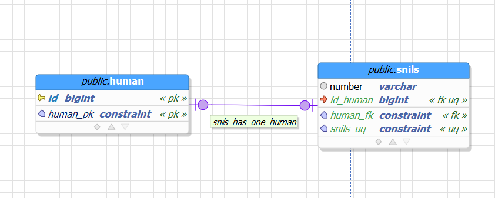
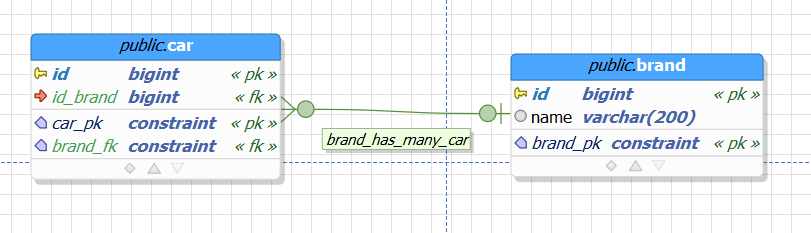
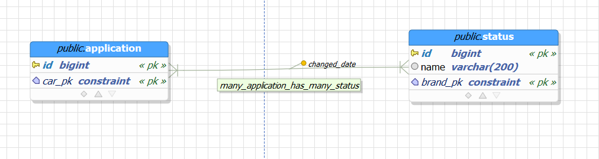

# Базы данных

## SQL vs NoSQL

К SQL СУБД принято относить реляционные базы данных.

РСУБД - это такие базы данных, в которых данные строго структурированы, имеют определенные типы данных, а также могут иметь связи друг с другом.

NoSQL - это не реляционные базы данных.

К ним относят документориентированные(MongoDB, Cassandra), колоночные(ClickHouse) и графовые базы(Neo4j), а также базы типа ключ-значения(Redis)

## Таблицы и все что с ними связано 

### Аттрибуты

Аттрибут, он же домен, он же колонка, он же поле - это все одно название для базового элемента таблицы.

Аттрибут описывает минимальный набор данных, например, фамилию, возраст или время запуска ракеты. Идейно, аттрибут похож на поле класса.

Аттрибут обязан иметь тип, например, строчный, целое число, время и тп.

### Строки или кортежи

Строка(кортеж) - это набор аттрибутов.

Строка показывает какой-то определенный объект или связь в рамках нашей предметной области. 
Строки должны быть уникальными, т.к. РСУБД работают на базе теории множеств.

### Таблицы

Таблица или сущность - это набор строк.

Она представляет собой список объектов в рамках нашей предметной области. А также описывает структуру данных, которую хранит.

### Ключи

Уникальность строк в рамках одной таблицы, можно гарантировать с помощью первичного ключа.

Первичный ключ - это такое УНИКАЛЬНОЕ значение или УНИКАЛЬНАЯ группа значений, которое(ая) позволяет однозначно идентифицировать строку в таблице.

Например, если мы храним в таблице информацию о человеке, таким ключом может быть СНИЛС, т.к. он уникальный для всех граждан России.

Первичные ключи бывают простые и составные. Простые - это ключи из 1 значения, составные - из набора. Выбор, что использовать, всегда остается за разработчиком.

Обычно в качестве первичного ключа применяют "синтетические" значения, например, порядковый номер: 1, 2, 3, ... 
или UUID - уникальную строку, например: `123e4567-e89b-12d3-a456-426655440000`.
Такой подход применяют, чтобы избавиться от привязки к реальным данным, т.к. они не всегда уникальны.

Помимо первичных ключей, таблицы очень часто содержат "внешние" ключи, это значения, 
которые указывают на первичные ключи других сущностей при наличии связи между ними.

### Связи таблиц

Таблицы или сущности могут быть связаны друг с другом, а также сами с собой с помощью 3-х видов связей:

 * Один-К-Одному
 * Один-К-Многим(Многие-К-Одному)
 * Многие-К-Многим

#### Один-К-Одному

Данный вид связи используется только в тех случаях, если одному экземпляру сущности, может одновременно соответствовать только 1 элемент другой.

Например, у человека не может быть более 1 СНИЛСа (он не обновляется даже в случае утраты). 

Такую связь обычно используют, чтобы разделить какую-то большую сущность на 2 и более, чтобы не оперировать за раз большими объемами данных.
Например, если у нас есть таблица на 50 полей (такое встречается) и часть из них редко используются, 
то резонно будет разделить такую таблицу на 2, разделив поля по принципу того, что чаще используется.

По сути, получается такой случай, когда у двух связанных сущностей первичный и внешний ключ равны.

#### Один-К-Многим(Многие-К-Одному)

Самый популярный вид связи. Используется, когда мы хотим показать, что одному экземпляру сущности, может соответствовать несколько экземпляров другой и наоборот.

Например, автомобиль обладает определенным брендом(Лада, Москвич и т.п.), чтобы не писать каждый раз название бренда в строке автомобиля, 
мы можем создать отдельную таблицу с брендами, и хранить там набор из всех возможных брендов, а непосредственно автомобилям просто проставлять "ссылки" на бренды.

В таком случае, внешний ключ содержит только таблица, строки которой могут быть связаны с одним значением другой сущности.
В примере выше, автомобиль содержит внешний ключ, указывающий на бренд, а не наоборот. 

#### Многие-К-Многим

Используется в тех случаях, если надо показать, что сущности могут взаимодействовать друг с другом "перекрестно". 

Например, мы делаем сайт пиццерии, у нас есть 2 сущности: _Пицца_ и _Ингредиент_. Если подумать, то окажется,
что пицца может содержать больше 1 ингредиента, например, сыр и колбасу, и, чтобы показать это отношение, применяют связь Многие-К-Многим.

Очень важным аспектом этой связи является то, что она всегда реализуется через отдельную таблицу, 
т.е. по сути, у нас вместо 2-х таблиц, получается 3, причем каждая из наших "основных" таблиц связана с "дополнительной" с помощью связи Один-К-Многим. 
И такое поведение дает нам очень большую гибкость, например, мы хотим отслеживать историю изменения статусов по какой-нибудь заявке, 
для этого мы можем соединить таблицы статуса и заявки связью Многие-К-Многим и в получившуюся таблицу добавить время создания записи,
таким образом, мы всегда будем знать в какой именно момент поменялся статус по нашей заявке.

Также очень часто в этой новой таблице в качестве первичного ключа используется пара внешних ключей, указывающих на связываемые таблицы.

# Проектирование бд

Это очень сложная и глубокая тема. В общих чертах проектирование заключается в 

Запросы к таблицам

# Полезные ссылки

1. https://metanit.com/sql/postgresql/